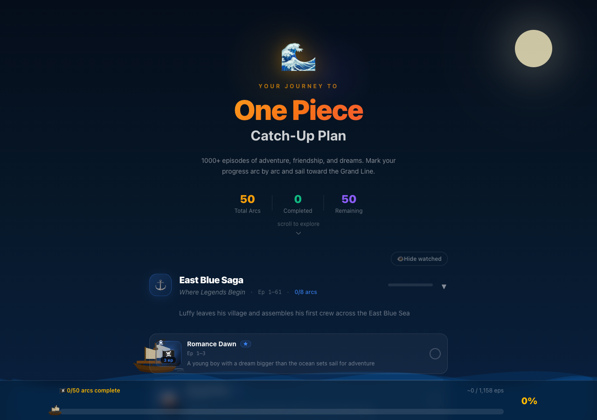

# One Piece Catchup

A visual guide for tracking your One Piece progress — browse every saga and arc, mark episodes as watched, and never lose your place again.

**Live site:** https://m00p1ng.github.io/one-piece-catchup/



## Features

- Browse all sagas and arcs with episode ranges
- Dedicated saga pages with arc lists and saga-level progress
- Track watched episodes at the arc level or episode-by-episode
- View key landmarks and must-watch moments per arc
- Arc detail page with villain, highlights, and episode-by-episode breakdown
- Animated pirate ship riding the progress bar across all pages
- Hide/show watched arcs toggle with smooth animations
- Collapsible saga sections

## Tech Stack

- React 19 + TypeScript
- Vite
- Tailwind CSS v4
- Framer Motion
- React Router v7

## Development

```bash
npm install
npm run dev
```

## Build

```bash
npm run build
```

## Deployment

Automatically deployed to GitHub Pages on push to `main` via GitHub Actions.
